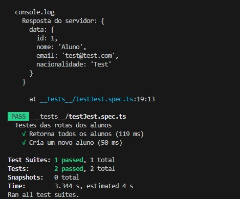

# Desafio 7 - Escola DNC

### Descrição

Projeto desenvolvido para a resolução do desafio 7 do curso formação de Tecnologia - Desenvolvedor Full-Stack da escola DNC.

### Instalação

##### Clone o repositório:

```
$ git clone https://github.com/MattMori/Desafio-7---DNC.git
```

##### Acesse a pasta criada:

```
$ cd Desafio-7---DNC
```

##### Instale as dependências:

```
$ npm install
```

---

##### Caso queira criar o banco de dados MySQL:

```mysql
CREATE TABLE `aluno` (
	`id` INT(11) NOT NULL AUTO_INCREMENT,
	`nome` VARCHAR(255) NOT NULL COLLATE 'utf8mb4_0900_ai_ci',
	`email` VARCHAR(255) NOT NULL COLLATE 'utf8mb4_0900_ai_ci',
	`nacionalidade` VARCHAR(255) NOT NULL COLLATE 'utf8mb4_0900_ai_ci',
	PRIMARY KEY (`id`) USING BTREE
)
COLLATE='utf8mb4_0900_ai_ci'
ENGINE=InnoDB
AUTO_INCREMENT=5
;
```

##### Configure o banco de dados no ficheiro knex.ts (src/config/knex.ts):

```javascript
const knexConfig: KnexConfig = {
  client: 'mysql2',
  connection: {
    host: 'localhost',
    port: 3306,
    user: 'user',
    password: 'password',
    database: 'db',
  },
}
```

---

### Testes

#### Iniciando o teste:

```
$ npm test --config=jest.config.ts
```

#### Teste Realizado:



---
